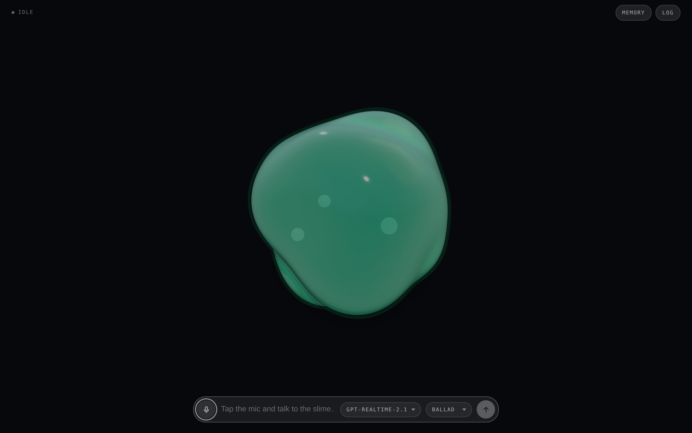
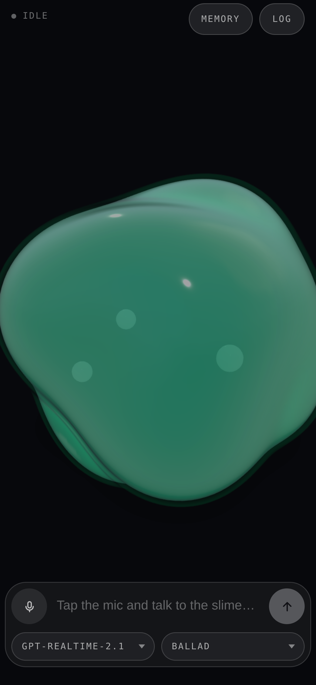

# Slime Orb

A voice agent rendered as a slime: translucent and colour-shifting, with its
wobble, glow and hue drift driven by a live OpenAI Realtime call. You talk, it
talks back, and the surface moves with whichever of you is making sound. It
remembers what you tell it to, between calls.



<p align="center">
  
</p>

## Run

```sh
git clone https://github.com/h1ddenpr0cess20/slimey
cd slimey
npm install
cp .env.example .env      # add your OPENAI_API_KEY
npm run dev               # → http://localhost:5173
```

Click the mic, allow the browser's microphone prompt, and start talking.

Tapping the mic is the microphone switch: turning it off stops what you send and
leaves the answer playing, and the conversation is still there when you turn it
back on. It also switches itself off after a minute of silence, and the call
survives that too. Holding the mic down is the hang-up — a ring closes around it
while you hold, and the call ends when it lands.

`tools` is where the switches for the slime's tools will be. It is empty today —
memory is all there is, and it has its own switch — but the panel and the
storage behind it are wired, so a tool the session learns to declare shows up
there with a switch of its own.

The log keeps every conversation. `continue` on one picks it back up: the call is
dialled again with those turns handed over as context, and what you say from
there lands in the same entry rather than a new one.

| Script | |
|---|---|
| `npm run dev` | Vite, with the proxy mounted as middleware — one process |
| `npm run dev:lan` | The same, over HTTPS on the network — for a phone |
| `npm run build` | Bundles the client to `dist/` |
| `npm start` | Serves `dist/` with the same proxy in front |
| `npm run preview` | `build` then `start` |
| `npm run preview:lan` | `build` then `start`, over HTTPS on the network |
| `npm test` | `node:test` over the server |
| `npm run lint` | ESLint |

CI runs the lint, the tests on Node 22.12 and 24, and a build that then has to
boot and serve itself over both HTTP and HTTPS. CodeQL scans the same source on
every push and again weekly, since its queries change faster than this does.

To run it on a phone, or in Docker, see
[configuration](docs/configuration.md#on-a-phone).

## Docs

- [**Configuration**](docs/configuration.md) — every environment variable, the
  HTTPS setup a phone needs for microphone access, and Docker.
- [**Design notes**](docs/design.md) — how the call is wired, what's in
  `localStorage`, the moods, the source layout, and the seam another provider
  would have to implement.
- [**AI Output Disclaimer**](docs/ai-output-disclaimer.md) — what the model says
  is the model's, not the author's, plus the risks that are specific to a live
  microphone and speech you hear before anyone can check it.
- [**Not a Companion**](docs/not-a-companion.md) — Slimey is a toy and a demo.
  It is not a friend, a therapist, or a partner, and the project will not grow in
  that direction.
